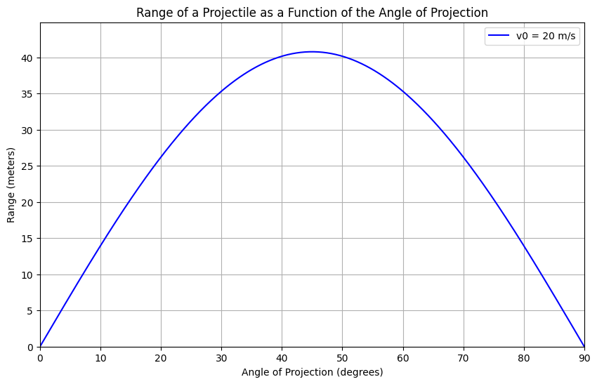

# Problem 1

Investigating the Range as a Function of the Angle of Projection


# 1. Theoretical Foundation
 Governing Equations of Motion:
Projectile motion can be analyzed using Newton's laws of motion. Assuming no air resistance, the motion can be decomposed into horizontal and vertical components:

# Equations of Motion:
- Horizontal:
  $$ x(t) = v_0 \cos(\theta) t $$
- Vertical:
  $$ y(t) = v_0 \sin(\theta) t - \frac{1}{2} g t^2 $$

where:

- $v_0$ is the initial velocity,
- $\theta$ is the launch angle,
- $g$ is the acceleration due to gravity,
- $t$ is the time.

# Time of Flight:
Setting \( y(t) = 0 \) to find the total flight time:
$$ t_f = \frac{2 v_0 \sin(\theta)}{g} $$

# Range Formula:

The horizontal range \( R \) is given by:

$$ R = v_0 \cos(\theta) t_f = \frac{v_0^2 \sin(2\theta)}{g} $$

This equation shows that the range is maximized at \( \theta = 45^\circ \), assuming other parameters remain constant.

---

# 2. Analysis of the Range

# Influence of Initial Conditions

- **Initial velocity (\( v_0 \))**: Increasing \( v_0 \) increases the range quadratically.
- **Gravitational acceleration (\( g \))**: Higher \( g \) reduces the range, as the projectile falls more quickly.
- **Launch angle (\( \theta \))**: The range follows a symmetric pattern, peaking at \( 45^\circ \).

# Graphical Representation

Python codes to demonstrate how the range changes:

```python
import numpy as np
import matplotlib.pyplot as plt

def range_function(theta, v0, g=9.81):
    return (v0**2 * np.sin(2 * np.radians(theta))) / g

# Parameters
v0 = 20  # initial velocity in m/s
theta = np.linspace(0, 90, 100)  # range of angles
g = 9.81  # gravity

# Compute ranges
ranges = range_function(theta, v0, g)

# Plot results
plt.figure(figsize=(8,5))
plt.plot(theta, ranges, label=f'v0 = {v0} m/s')
plt.xlabel('Launch Angle (degrees)')
plt.ylabel('Range (m)')
plt.title('Projectile Range vs. Launch Angle')
plt.legend()
plt.grid()
plt.show()
```



---

# 3. Practical Applications

-Sports: Athletes and coaches use principles of projectile motion to optimize performance in events like javelin throwing, shot put, and long jump, where launch angles and velocities are critical.
Engineering: In ballistics and military applications, understanding projectile trajectories is essential for designing artillery, missiles, and other projectile-based systems.
Astrophysics: Astronomers apply these principles to model the trajectories of celestial bodies, such as comets and asteroids, and to plan space missions.
---

# 4. Implementation

To analyze scenarios involving air resistance, we can incorporate drag forces into our model. This leads to differential equations that require numerical methods, such as the Runge-Kutta method, for solution.
# Example: Adding Air Resistance

The equations with drag $F_d = -k v^2$ lead to:

$$m \frac{d^2 x}{dt^2} = -k v_x^2$$
$$m \frac{d^2 y}{dt^2} = -mg - k v_y^2$$

A numerical solver like Python's SciPy can be used to compute solutions.

---

# 5. Limitations and Further Considerations

- Air resistance - Causes asymmetry and reduces range.
- Uneven terrain - Requires solving for complex boundary conditions.
- Wind effects - Affects trajectory unpredictably.


---

# Conclusion

Projectile motion demonstrates rich mathematical and physical insights. While the idealized model provides a good approximation, real-world adaptations require numerical solutions to account for non-ideal conditions.
- Initial velocity ($v_0$): The range is proportional to the square of the initial velocity. Increasing $v_0$ significantly increases the range.
- Gravitational acceleration ($g$): The range is inversely proportional to the gravitational acceleration. Higher $g$ reduces the range.
- Launch angle ($\theta$): The range is maximized at $\theta = 45^\circ$, and it is symmetric around this angle.
 
