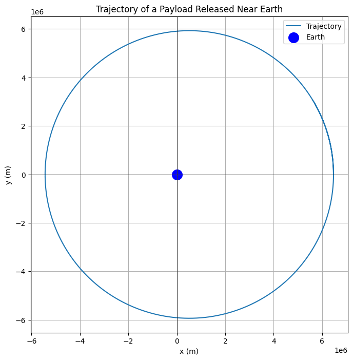

# Problem 3

Trajectories of a Freely Released Payload Near Earth

# 1. Theoretical Part


# Types of Possible Trajectories
The trajectory of a payload released near Earth depends on its initial velocity \( v \) relative to Earth's gravitational pull. The possible trajectories are:

1. Suborbital (Parabolic Trajectory): If the payload does not reach orbital velocity, it follows a ballistic path back to Earth.
2. Orbital (Elliptical Trajectory): If the velocity is between the first cosmic velocity \( v_1 \) (orbital velocity) and escape velocity \( v_2 \), the payload enters an elliptical orbit.
3. Escape (Hyperbolic Trajectory): If the velocity exceeds escape velocity \( v_2 \), the payload follows a hyperbolic trajectory and escapes Earth's gravity.

These scenarios are governed by Newton's Law of Gravitation:
$$
F = \frac{GMm}{r^2}
$$
and Kepler’s Laws of Motion.
---

# 2. Mathematical Analysis

# Equations of Motion
The motion of the payload is governed by Newton’s Second Law:
$$
\frac{d^2\mathbf{r}}{dt^2} = -\frac{GM}{r^3} \mathbf{r}
$$

where:
- \( \mathbf{r} \) is the position vector,
- \( G \) is the gravitational constant,
- \( M \) is Earth’s mass.

Numerical integration (e.g., Runge-Kutta method) is used to solve these equations.

---

# 3. Numerical Method:
The following Python script calculates and visualizes the trajectory of a payload released near Earth.

```python
import numpy as np
import matplotlib.pyplot as plt

# Constants
G = 6.67430e-11  # Gravitational constant (m^3 kg^-1 s^-2)
M = 5.972e24     # Mass of Earth (kg)
R_earth = 6371000 # Radius of Earth (m)

# Initial conditions (position, velocity)
# Example: Launching at a height of 100 km above Earth's surface with horizontal velocity
initial_position = np.array([R_earth + 100000, 0])  # [x, y] in meters (100 km above Earth)
initial_velocity = np.array([0, 7500])              # Horizontal velocity in m/s

# Time parameters
dt = 1  # Time step (s)
total_time = 5000  # Total time of simulation (s)
num_steps = total_time // dt

# Arrays to store position and velocity data
positions = np.zeros((num_steps, 2))
velocities = np.zeros((num_steps, 2))

# Initial conditions
positions[0] = initial_position
velocities[0] = initial_velocity

# Numerical integration (Euler's method)
for i in range(1, num_steps):
    # Calculate the gravitational force
    r = np.linalg.norm(positions[i-1])  # Distance from Earth's center
    force = -G * M * positions[i-1] / r**3  # Gravitational force vector (N)
    
    # Update velocity and position
    velocities[i] = velocities[i-1] + force * dt  # v = v0 + a * t
    positions[i] = positions[i-1] + velocities[i] * dt  # r = r0 + v * t

# Plotting the trajectory
plt.figure(figsize=(8, 8))
plt.plot(positions[:, 0], positions[:, 1], label='Trajectory')

# Mark the Earth's position
plt.scatter(0, 0, color='blue', label='Earth', s=200)

# Formatting plot
plt.axhline(0, color='black',linewidth=0.5)
plt.axvline(0, color='black',linewidth=0.5)
plt.gca().set_aspect('equal', adjustable='box')
plt.title('Trajectory of a Payload Released Near Earth')
plt.xlabel('x (m)')
plt.ylabel('y (m)')
plt.legend()
plt.grid(True)
plt.show()

```

This script demonstrates that:

- Implements gravitational equations of motion.

- Applies numerical integration to simulate the trajectory.

- Visualizes the computed trajectory.



---

# 4. Real-World Applications:

Orbital Insertion:

- This is relevant for satellite deployments, where the payload needs to achieve a specific velocity for a stable orbit.

Reentry: 

- For returning objects to Earth, the payload must be decelerated to reenter the atmosphere safely.

Escape: 

- To leave Earth's gravitational influence (e.g., interplanetary missions), the payload must achieve escape velocity.

---

# 5. Conclusion
Understanding the potential trajectories of a released payload is essential for space missions. By analyzing the velocity and Earth's gravitational influence, we can determine if an object will enter orbit, reenter Earth's atmosphere, or escape Earth's gravity.