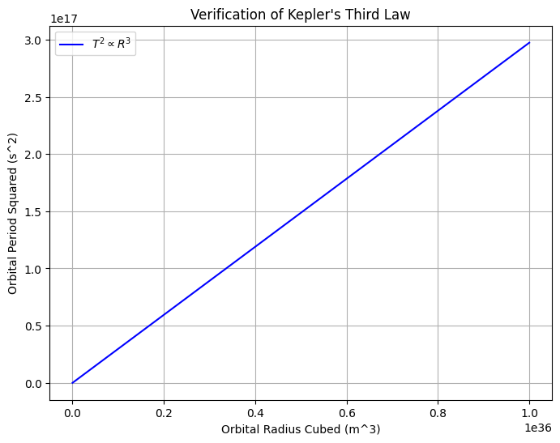

# Problem 1


Orbital Period and Orbital Radius

# 1. Theoretical Foundation

# 1.1 Kepler’s Third Law
Kepler’s Third Law states that the square of a planet’s orbital period \( T \) is proportional to the cube of its orbital radius \( R \):

$$
T^2 \propto R^3
$$
For a circular orbit, the relationship can be derived by combining Newton's law of gravitation with the concept of centripetal force. Newton's law of gravitation states that the gravitational force between two masses is proportional to the product of their masses and inversely proportional to the square of the distance between them. The centripetal force is the force that keeps an object moving in a circular path and is directed toward the center of the orbit.

1. **Gravitational Force as Centripetal Force:**
   $$
   \frac{GMm}{R^2} = m \frac{v^2}{R}
   $$
  
   where:
   - \( G \) is the gravitational constant,
   - \( M \) is the mass of the central body,
   - \( m \) is the mass of the orbiting body,
   - \( R \) is the orbital radius,
   - \( v \) is the orbital velocity.

2. **Orbital Velocity from Period:**
   The orbital velocity \( v \) is related to the orbital period \( T \) as:
   $$
   v = \frac{2 \pi R}{T}
   $$

3. **Deriving Kepler’s Third Law:**
   Substituting \( v \) into the force equation and solving for \( T \), we get:
   $$
   T^2 = \frac{4 \pi^2}{GM} R^3
   $$
   This confirms that \( T^2 \propto R^3 \), where the proportionality constant depends on \( G \) and \( M \).

# 1.2 Implications in Astronomy
- Calculating Planetary Mass: Using the period and radius of a planet's moon, we can calculate the mass of the planet.

- Estimating Orbital Radius: If the period of a planet's orbit around the Sun is known, we can estimate its orbital radius.

- Designing Satellite Orbits: This principle is used to create stable satellite orbits around Earth and other celestial bodies.

---

# 2. Real-World Examples

1. **The Moon’s Orbit around Earth**
   - The Moon orbits Earth with a period of \( T = 27.3 \) days.
   - The average orbital radius is about \( 3.84 \times 10^5 \) km.
   - Using Kepler’s law, we can verify the mass of Earth.

2. **Planets in the Solar System**
   - Kepler’s law allows us to compare planetary orbits.
   - Example: Earth’s orbital radius \( 1 \) AU and period \( 1 \) year help determine distances of other planets.

---

# 3. Computational Model
The following Python script simulates verifies Kepler’s Third Law.

```python
import numpy as np
import matplotlib.pyplot as plt

# Constants
G = 6.67430e-11  # Gravitational constant (m^3 kg^-1 s^-2)
M_sun = 1.989e30  # Mass of the Sun (kg)

# Function to calculate orbital period
def orbital_period(radius, mass=M_sun):
    return 2 * np.pi * np.sqrt(radius**3 / (G * mass))

# Generate data
radii = np.logspace(9, 12, 100)  # Orbital radii from 10^9 to 10^12 meters
periods = orbital_period(radii)

# Verify Kepler's Third Law
T_squared = periods**2
R_cubed = radii**3

# Plot T^2 vs R^3
plt.figure(figsize=(8,6))
plt.plot(R_cubed, T_squared, label="$T^2 \propto R^3$", color='b')
plt.xlabel("Orbital Radius Cubed (m^3)")
plt.ylabel("Orbital Period Squared (s^2)")
plt.title("Verification of Kepler's Third Law")
plt.legend()
plt.grid()
plt.show()

# Simulating circular orbit
def circular_orbit(radius, num_points=100):
    theta = np.linspace(0, 2*np.pi, num_points)
    x = radius * np.cos(theta)
    y = radius * np.sin(theta)
    return x, y

# Plot circular orbits for different radii
plt.figure(figsize=(8,8))
for r in [1e10, 3e10, 5e10]:
    x, y = circular_orbit(r)
    plt.plot(x, y, label=f"Radius = {r:.0e} m")

plt.scatter(0, 0, color='orange', label='Central Mass (e.g., Sun)')
plt.xlabel("x position (m)")
plt.ylabel("y position (m)")
plt.title("Simulated Circular Orbits")
plt.legend()
plt.grid()
plt.axis("equal")
plt.show()
```

This script:
- Calculates the time taken for an object to complete an orbit at various distances.
- Plots \( T^2 \) vs. \( R^3 \) to confirm a linear relationship.




---

# 4. Extensions and Limitations

- Elliptical Orbits: Kepler’s Third Law still holds, but instead of a fixed radius, the semi-major axis determines the orbital period.

- Relativistic Effects: In regions with intense gravity, such as near massive stars or black holes, general relativity introduces corrections to Kepler’s laws.

- External Forces: Gravitational influences from other celestial bodies can cause deviations in orbits over long periods, leading to phenomena like precession and orbital resonance.


---

# 5. Conclusion
Kepler’s Third Law establishes a crucial connection between orbital period and radius, allowing precise calculations in celestial mechanics. This principle is essential in astronomy, satellite navigation, and space mission planning.
