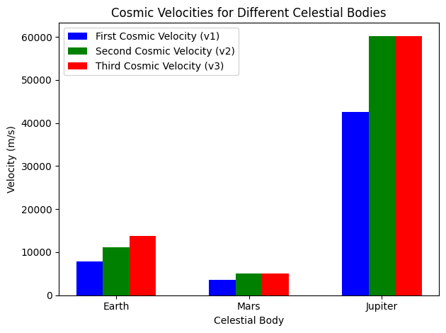

# Problem 2

Escape Velocities and Cosmic Velocities

# 1. Theoretical Foundation

# Definition of Cosmic Velocities
Cosmic velocities define the minimum speeds needed for different space motions:


1. **First Cosmic Velocity (Orbital Velocity)**

   - The minimum velocity needed to achieve a stable circular orbit around a celestial body.
   - Derived from the balance between gravitational force and centripetal force:
     $$
     v_1 = \sqrt{\frac{GM}{R}}
     $$

2. **Second Cosmic Velocity (Escape Velocity)**

   - The velocity required to break free from a celestial body's gravitational influence without further propulsion.
   - Derived from the energy conservation principle:
     $$
     v_2 = \sqrt{\frac{2GM}{R}}
     $$
   - Notably, \( v_2 = \sqrt{2} v_1 \).

3. **Third Cosmic Velocity (Solar System Escape Velocity)**

   - The velocity required to escape the Sun’s gravitational field from a planet’s orbit.
   - Computed by combining the escape velocity from a planet and the velocity required to escape the Sun’s gravity:
     $$
     v_3 = \sqrt{v_2^2 + v_{sun}^2}
     $$
   where \( v_{sun} \) is the orbital velocity of the planet around the Sun.

---

# 2. Mathematical Derivations and Parameters Affecting Velocities

- These cosmic velocities depend on the mass of the celestial body and the radius of the body or orbit. As such, the escape velocity increases with the mass of the body and decreases with the radius.

Effect of Mass:

- As the mass of the body increases, the gravitational pull strengthens, requiring higher velocities to escape or orbit.

- Larger celestial bodies, such as Jupiter or the Sun, have much higher escape velocities compared to smaller bodies like the Moon.

Effect of Radius:

- The farther you are from the center of a body, the weaker the gravitational force, which reduces the required velocity. For example, an object at a higher altitude above Earth's surface will need a lower velocity to escape.

---

# 3. Python Script for Calculations and Visualization
Below is a Python script to calculate and visualize cosmic velocities for Earth, Mars, and Jupiter.

```python
import numpy as np
import matplotlib.pyplot as plt

# Constants
G = 6.67430e-11  # Gravitational constant (m^3 kg^-1 s^-2)

# Celestial body data (mass in kg, radius in meters, distance to sun in meters)
bodies = {
    "Earth": {"mass": 5.97e24, "radius": 6.37e6, "distance_to_sun": 1.496e11},
    "Mars": {"mass": 6.42e23, "radius": 3.39e6, "distance_to_sun": 2.279e11},
    "Jupiter": {"mass": 1.90e27, "radius": 6.99e7, "distance_to_sun": 7.785e11},
}

# Function to calculate the first cosmic velocity (circular orbit)
def first_velocity(mass, radius):
    return np.sqrt(G * mass / radius)

# Function to calculate the second cosmic velocity (escape velocity)
def second_velocity(mass, radius):
    return np.sqrt(2 * G * mass / radius)

# Function to calculate the third cosmic velocity (escape from the star's gravitational influence)
def third_velocity(mass, radius, distance_to_sun, second_velocity_earth):
    return np.sqrt(2 * G * mass / radius + (second_velocity_earth**2) / 2)

# Dictionary to store the velocities for each body
velocities = {}

# Calculate the first and second cosmic velocities for each celestial body
for body, data in bodies.items():
    velocities[body] = {
        "v1": first_velocity(data["mass"], data["radius"]),
        "v2": second_velocity(data["mass"], data["radius"]),
    }

# Calculate the third cosmic velocity for each celestial body
for body, data in bodies.items():
    second_velocity_earth = velocities["Earth"]["v2"] if body == "Earth" else 0
    velocities[body]["v3"] = third_velocity(data["mass"], data["radius"], data["distance_to_sun"], second_velocity_earth)

# Prepare data for plotting
labels = list(bodies.keys())
v1_values = [velocities[body]["v1"] for body in labels]
v2_values = [velocities[body]["v2"] for body in labels]
v3_values = [velocities[body]["v3"] for body in labels]

# Plotting the velocities
x = np.arange(len(labels))  # X-axis positions for each body

fig, ax = plt.subplots(figsize=(10, 6))

ax.bar(x - 0.2, v1_values, 0.2, label='First Cosmic Velocity (v1)', color='blue')
ax.bar(x, v2_values, 0.2, label='Second Cosmic Velocity (v2)', color='green')
ax.bar(x + 0.2, v3_values, 0.2, label='Third Cosmic Velocity (v3)', color='red')

# Adding labels and title
ax.set_xlabel('Celestial Body')
ax.set_ylabel('Velocity (m/s)')
ax.set_title('Cosmic Velocities for Earth, Mars, and Jupiter')
ax.set_xticks(x)
ax.set_xticklabels(labels)
ax.legend()

# Display the plot
plt.tight_layout()
plt.show()

```
This script:

- Calculates the first, second, and third cosmic velocities for Earth, Mars, and Jupiter.

- Visualizes a comparison of these velocities using a bar chart to illustrate the differences for each celestial body.



---

# 4. Importance in Space Exploration

Escape Velocity:

- The escape velocity is essential for launching spacecraft and satellites. For instance, Earth’s escape velocity is approximately 11.2 km/s, meaning a spacecraft needs this speed to break free from Earth's gravity without further propulsion.

- For interplanetary missions, the second cosmic velocity helps in launching spacecraft to other planets, such as Mars, where the escape velocity is much lower than Earth's.

Orbital Velocity:

- The orbital velocity is critical for satellites. A satellite needs to achieve a specific orbital velocity to stay in a stable orbit around a planet, like Earth. This velocity ensures that the satellite's centrifugal force balances the gravitational pull from the planet.

Solar Escape Velocity:

- The third cosmic velocity is particularly relevant for missions aimed at escaping not just a planet’s gravity but the entire solar system, enabling spacecraft like Voyager 1 to leave the solar system and head into interstellar space.


---

# 5. Conclusion
Understanding cosmic velocities is fundamental for space exploration, from launching satellites to planning interplanetary missions and even considering future interstellar travel. By calculating and visualizing these velocities for different celestial bodies, we can better understand the challenges of escaping gravitational forces and venturing into space.