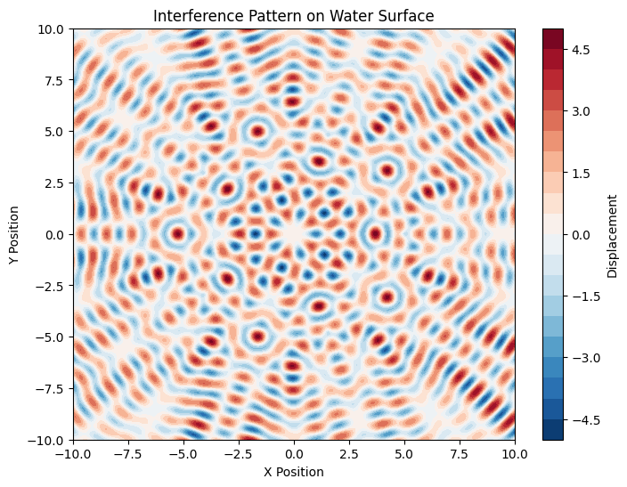

# Problem 1

Interference Patterns on a Water Surface

# 1. Theory

# Interference Patterns on a Water Surface

Interference occurs when two or more waves meet and superpose. On a water surface, when waves emanate from different point sources, they overlap, creating an interference pattern. This is a fundamental concept in wave theory and can be observed in phenomena like water ripples. These interference patterns are crucial for understanding how waves combine, either reinforcing (constructive interference) or canceling out (destructive interference).


---

# 2. Problem Setup

# 2.1. Choosing a Regular Polygon
We begin by selecting a regular polygon, such as an equilateral triangle, square, or pentagon. The wave sources are positioned at the vertices of the chosen polygon, ensuring they are equidistant from one another.

# 2.2. Computing the Superposition
Each of the selected vertices acts as an individual wave source. The waves emitted from each source overlap and interfere with each other. The resulting interference pattern is obtained by summing the contributions from all sources, applying the principle of superposition to determine the final displacement at every point on the water surface. This process takes into account the distance from each point on the surface to each source and their corresponding phases.

---

# 3. Computational Model
The following Python script simulates and visualizes the interference pattern.

```python
import numpy as np
import matplotlib.pyplot as plt

# Constants
A = 1.0  # Amplitude of the wave
lambda_ = 1.0  # Wavelength
f = 1.0  # Frequency
omega = 2 * np.pi * f  # Angular frequency
k = 2 * np.pi / lambda_  # Wave number
phi_0 = 0  # Initial phase

# Define the vertices of the regular polygon
num_sources = 5  # Example: Regular pentagon
radius = 5.0  # Distance from the center to the vertices

# Function to compute the displacement at a given point
def wave_displacement(x, y, source_x, source_y, A, k, omega, t, phi_0):
    r = np.sqrt((x - source_x)**2 + (y - source_y)**2)
    return A * np.sin(k * r - omega * t + phi_0)

# Generate grid points for simulation
x_vals = np.linspace(-10, 10, 400)
y_vals = np.linspace(-10, 10, 400)
X, Y = np.meshgrid(x_vals, y_vals)

# Time variable for animation or static plot
t = 0  # You can vary this to see the change over time

# Calculate the displacement due to all sources
total_displacement = np.zeros_like(X)

# Position of the sources at the vertices of the polygon
angles = np.linspace(0, 2 * np.pi, num_sources, endpoint=False)
sources_x = radius * np.cos(angles)
sources_y = radius * np.sin(angles)

# Sum the wave displacements from all sources
for i in range(num_sources):
    total_displacement += wave_displacement(X, Y, sources_x[i], sources_y[i], A, k, omega, t, phi_0)

# Plot the interference pattern
plt.figure(figsize=(8, 6))
cp = plt.contourf(X, Y, total_displacement, 20, cmap='RdBu_r')
plt.colorbar(cp, label='Displacement')
plt.title('Interference Pattern on Water Surface')
plt.xlabel('X Position')
plt.ylabel('Y Position')
plt.show()

```



---

# 4. Observations and Analysis
The code simulates the interference pattern by calculating the displacement at each point on a 2D grid from the superposition of waves emitted from sources positioned at the vertices of a regular polygon.

- **Wave Behavior**: Each wave follows the form of a circular wave, and the displacement is computed at each grid point by considering the sum of the contributions from all sources.

- **Superposition Principle**: The resulting interference pattern is generated by summing the individual wave displacements. The constructive interference (where waves amplify) occurs where the displacements from the waves align, and destructive interference (where waves cancel out) occurs where the waves are out of phase.

- **Number of Sources**: By varying the number of sources (vertices of the polygon), different interference patterns are formed. For example, a pentagon creates a different pattern than a square or triangle due to the different geometric arrangements of the sources.

- **Visualization**: The contourf plot visually represents the displacement on the water surface, showing regions of constructive (bright) and destructive (dark) interference.

---

# 5. Conclusion
By analyzing the interference patterns created by point sources arranged in a regular polygon, we can visualize how waves interact in a two-dimensional medium. The principle of superposition leads to the formation of complex interference patterns that are influenced by the number of sources and their positions. These patterns are essential for understanding wave behavior, and the same principles can be applied to more advanced wave phenomena in fields such as acoustics, optics, and electromagnetic waves.
