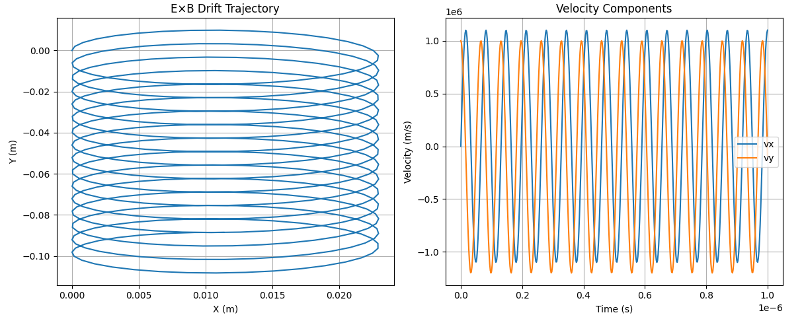
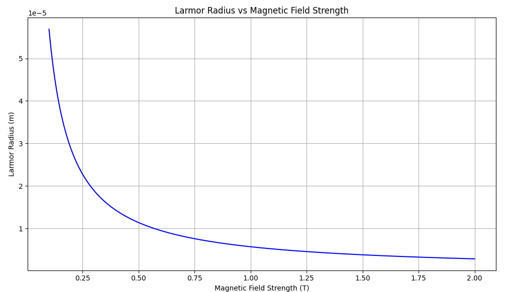
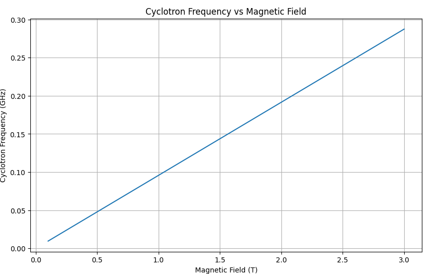

Investigating Charged Particle Motion under Electromagnetic Fields

# 1. Theoretical Foundation

 Governing Equations
The motion of charged particles in electromagnetic fields is governed by the Lorentz force:

$$ \mathbf{F} = q\mathbf{E} + q\mathbf{v} \times \mathbf{B} $$

Newton's second law:

$$ m\frac{d\mathbf{v}}{dt} = q\mathbf{E} + q\mathbf{v} \times \mathbf{B} $$

In component form for 3D motion:

$$ m\frac{dv_x}{dt} = qE_x + q(v_yB_z - v_zB_y) $$
$$ m\frac{dv_y}{dt} = qE_y + q(v_zB_x - v_xB_z) $$
$$ m\frac{dv_z}{dt} = qE_z + q(v_xB_y - v_yB_x) $$

# Key Parameters

1. **Cyclotron Frequency:**
$$ \omega_c = \frac{qB}{m} $$

2. **Larmor Radius:**
$$ r_L = \frac{mv_\perp}{qB} $$

3. **E×B Drift Velocity:**
$$ \mathbf{v}_d = \frac{\mathbf{E} \times \mathbf{B}}{B^2} $$

Let's simulate these motions using Python:

```python
import numpy as np
import matplotlib.pyplot as plt
from mpl_toolkits.mplot3d import Axes3D
from scipy.integrate import odeint

def lorentz_force(state, t, q, m, E, B):
    x, y, z, vx, vy, vz = state
    
    # Force components
    dvx_dt = (q/m) * (E[0] + vy*B[2] - vz*B[1])
    dvy_dt = (q/m) * (E[1] + vz*B[0] - vx*B[2])
    dvz_dt = (q/m) * (E[2] + vx*B[1] - vy*B[0])
    
    return [vx, vy, vz, dvx_dt, dvy_dt, dvz_dt]

# Parameters
q = 1.6e-19  # electron charge
m = 9.1e-31  # electron mass
t = np.linspace(0, 1e-9, 1000)

# Case 1: Uniform Magnetic Field
B = [0, 0, 1.0]  # Tesla
E = [0, 0, 0]    # V/m
initial_state = [0, 0, 0, 1e6, 1e6, 0]  # Initial position and velocity

solution = odeint(lorentz_force, initial_state, t, args=(q, m, E, B))

# Plot trajectory
fig = plt.figure(figsize=(10, 8))
ax = fig.add_subplot(111, projection='3d')
ax.plot(solution[:, 0], solution[:, 1], solution[:, 2])
ax.set_xlabel('X (m)')
ax.set_ylabel('Y (m)')
ax.set_zlabel('Z (m)')
ax.set_title('Particle Motion in Uniform Magnetic Field')
plt.show()
```


# Analysis of Different Field Configurations

Let's examine the E×B drift:

```python
import numpy as np
import matplotlib.pyplot as plt
from scipy.integrate import odeint

def lorentz_force(state, t, q, m, E, B):
    """
    Calculates the Lorentz force and returns the derivatives of the state variables.

    Args:
        state:  [x, y, z, vx, vy, vz] (position and velocity)
        t:      Time (not used in this autonomous equation, but required by odeint)
        q:      Charge of the particle
        m:      Mass of the particle
        E:      Electric field vector [Ex, Ey, Ez]
        B:      Magnetic field vector [Bx, By, Bz]

    Returns:
        [dx/dt, dy/dt, dz/dt, dvx/dt, dvy/dt, dvz/dt]
    """
    x, y, z, vx, vy, vz = state
    # Calculate the electric force
    Fx = q * E[0]
    Fy = q * E[1]
    Fz = q * E[2]

    # Calculate the magnetic force (cross product)
    Fx += q * (vy * B[2] - vz * B[1])
    Fy += q * (vz * B[0] - vx * B[2])
    Fz += q * (vx * B[1] - vy * B[0])

    # Calculate the derivatives
    dxdt = vx
    dydt = vy
    dzdt = vz
    dvxdt = Fx / m
    dvydt = Fy / m
    dvzdt = Fz / m
    return dxdt, dydt, dzdt, dvxdt, dvydt, dvzdt

# Case 2: Crossed E and B fields
E = [1e5, 0, 0]  # V/m
B = [0, 0, 1.0]  # Tesla
initial_state = [0, 0, 0, 0, 1e6, 0]  # x, y, z, vx, vy, vz
q = 1.6e-19  # Charge of a proton (Coulombs)
m = 1.67e-27  # Mass of a proton (kg)
t = np.linspace(0, 1e-6, 500)  # Time vector from 0 to 1 microsecond, 500 points

solution_ExB = odeint(lorentz_force, initial_state, t, args=(q, m, E, B))

# Plot E×B drift
plt.figure(figsize=(12, 5))
plt.subplot(121)
plt.plot(solution_ExB[:, 0], solution_ExB[:, 1])
plt.xlabel('X (m)')
plt.ylabel('Y (m)')
plt.title('E×B Drift Trajectory')
plt.grid(True)

# Plot velocity components
plt.subplot(122)
plt.plot(t, solution_ExB[:, 3], label='vx')
plt.plot(t, solution_ExB[:, 4], label='vy')
plt.xlabel('Time (s)')
plt.ylabel('Velocity (m/s)')
plt.title('Velocity Components')
plt.legend()
plt.grid(True)
plt.tight_layout()
plt.show()

```



# 2. Parameter Study

Let's investigate how the Larmor radius changes with magnetic field strength:

```python
import numpy as np
import matplotlib.pyplot as plt

# Constants
q = 1.6e-19       # Charge of the particle (C)
m = 9.1e-31       # Mass of the particle (kg)
v_perp = 1e6      # Perpendicular velocity (m/s)

# Larmor radius function
def larmor_radius(v_perp, B, q, m):
    return m * v_perp / (q * B)

# Range of magnetic field values (T)
B_values = np.linspace(0.1, 2.0, 200)

# Compute radii
radii = larmor_radius(v_perp, B_values, q, m)

# Plotting
plt.figure(figsize=(10, 6))
plt.plot(B_values, radii, color='blue')
plt.xlabel('Magnetic Field Strength (T)')
plt.ylabel('Larmor Radius (m)')
plt.title('Larmor Radius vs Magnetic Field Strength')
plt.grid(True)
plt.tight_layout()
plt.show()

```



# 3. Applications

# Cyclotron Operation

The cyclotron frequency determines particle acceleration:

```python
import numpy as np
import matplotlib.pyplot as plt

def cyclotron_freq(B, q, m):
    """Calculates the cyclotron frequency.

    Args:
        B: Magnetic field strength (T)
        q: Charge of the particle (C)
        m: Mass of the particle (kg)

    Returns:
        Cyclotron frequency (Hz)
    """
    return q * B / m

# Constants
q = 1.6e-19  # Charge of a proton (C)
m = 1.67e-27  # Mass of a proton (kg)

# Generate magnetic field values
B_range = np.linspace(0.1, 3.0, 100)  # Tesla

# Calculate cyclotron frequencies
frequencies = [cyclotron_freq(B, q, m) for B in B_range]

# Plotting
plt.figure(figsize=(10, 6))
plt.plot(B_range, np.array(frequencies) / 1e9)  # Convert to GHz
plt.xlabel('Magnetic Field (T)')
plt.ylabel('Cyclotron Frequency (GHz)')
plt.title('Cyclotron Frequency vs Magnetic Field')
plt.grid(True)
plt.show()

# Create table data for display
table_data = {'Magnetic Field (T)': B_range, 'Cyclotron Frequency (GHz)': np.array(frequencies) / 1e9}

# Print the table
print("Magnetic Field (T)  | Cyclotron Frequency (GHz)")
print("-------------------|---------------------------")
for B, f in zip(B_range, frequencies):
    print(f"{B:.2f}                | {f / 1e9:.2f}") # formatted output


```



# 4. Advanced Analysis: Non-uniform Fields

Uniform Magnetic Field: The particle moves in a circle (if the initial velocity is perpendicular to the field) or a helix (if the initial velocity has a component parallel to the field). The radius of the circle (Larmor radius) is given by r=mv/(qB) . This motion is fundamental to cyclotrons, where particles are accelerated in a spiral path by a combination of magnetic and electric fields.
Combined Uniform Electric and Magnetic Fields: The particle exhibits helical motion with a drift velocity in the direction perpendicular to both the electric and magnetic fields. This E×B drift is important in plasma physics and is used in devices like magnetrons.

# 5. Practical Applications

# Particle Accelerators
- Cyclotrons
- Synchrotrons 
- Linear accelerators

# Plasma Confinement
- Tokamaks
- Magnetic mirrors
- Stellarators

# Scientific Instruments
- Mass spectrometers
- Electron microscopes
- Beta-ray spectrometers

# Conclusion

The Lorentz force is a fundamental mechanism for controlling charged particle motion. Our simulations illustrate how various field configurations are applied in modern physics and technology, demonstrating the versatility of electric and magnetic fields in particle manipulation and confinement.

# Future Extensions
Include effects of relativity for high-speed particles

Add particle collisions and interaction effects

Simulate more detailed field geometries

Include quantum effects at very low energy levels