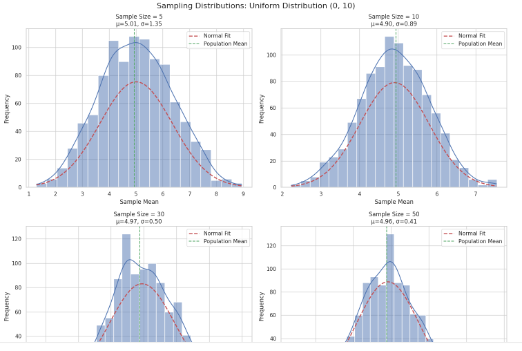
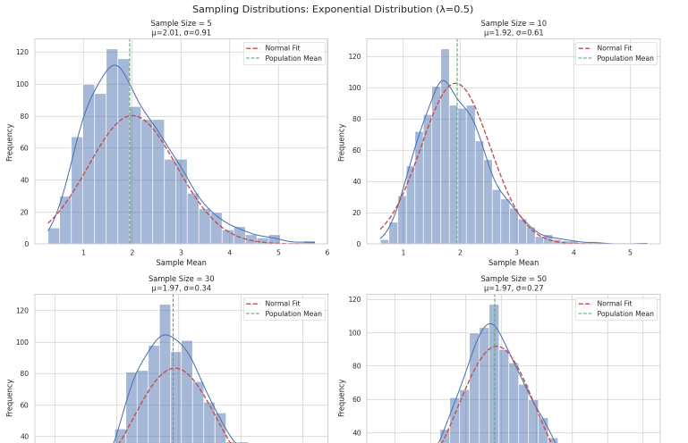
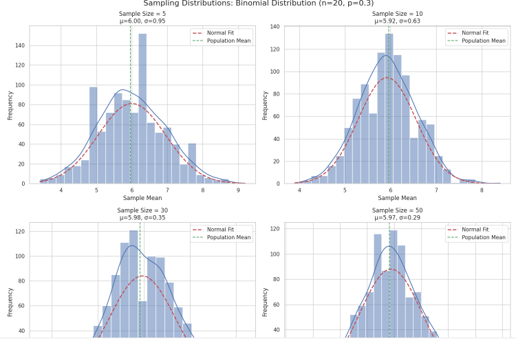
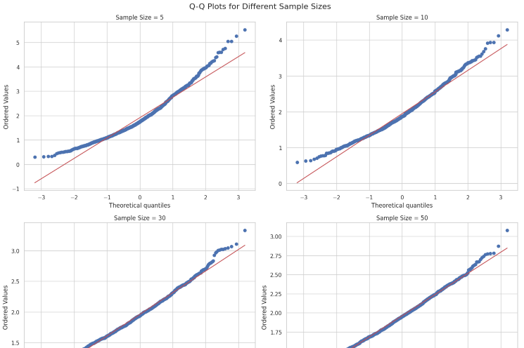
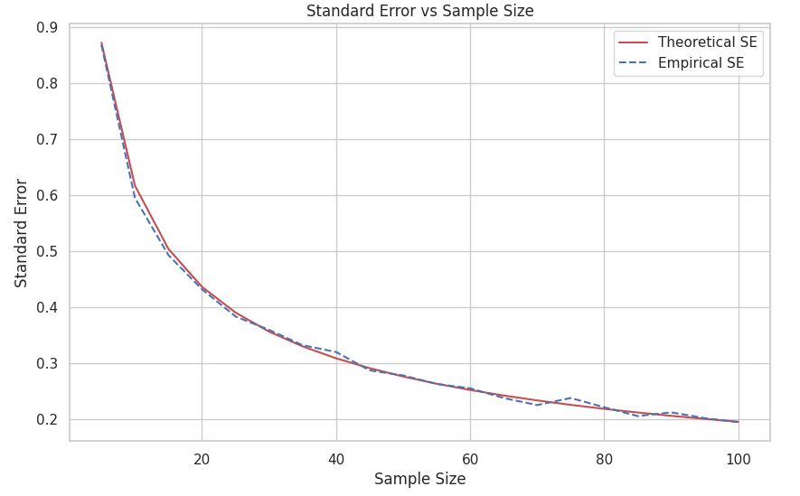

# Problem 1


Exploring the Central Limit Theorem through Simulations

# 1.1 Theoretical Part

The Central Limit Theorem (CLT) asserts that the distribution of sample means approximates a normal distribution as the sample size increases, regardless of the population’s original distribution. Through simulation, we can visualize and understand this convergence.

# 1.2 Mathematical Expression

For a population with mean μ and variance σ², if we take samples of size n:

$$ \bar{X}_n \sim N(\mu, \frac{\sigma^2}{n}) $$

where $\bar{X}_n$ is the sample mean distribution.

The standardized form of the sampling distribution follows:

$$ \frac{\bar{X}_n - \mu}{\sigma/\sqrt{n}} \sim N(0,1) $$

## 2. Implementation and Analysis

We’ll examine three population distributions:

- Uniform Distribution

- Exponential Distribution

- Binomial Distribution

```python
import numpy as np
import matplotlib.pyplot as plt
import seaborn as sns
from scipy import stats

# Set random seed for reproducibility
np.random.seed(42)

# For Colab, we need to use this to display plots
%matplotlib inline

# Plotting style configuration
sns.set_style("whitegrid")  # This is more reliable than plt.style.use('seaborn')
plt.rcParams['figure.figsize'] = (12, 8)

def plot_sampling_distribution(population, sample_sizes, n_samples=1000, title=""):
    fig, axes = plt.subplots(2, 2, figsize=(15, 12))
    fig.suptitle(f'Sampling Distributions: {title}', fontsize=16)
    
    for i, n in enumerate(sample_sizes):
        row = i // 2
        col = i % 2
        
        # Generate sample means
        sample_means = [np.mean(np.random.choice(population, size=n)) 
                       for _ in range(n_samples)]
        
        # Plot histogram with KDE
        sns.histplot(sample_means, kde=True, ax=axes[row, col])
        
        # Add normal distribution fit
        mu = np.mean(sample_means)
        sigma = np.std(sample_means)
        x = np.linspace(min(sample_means), max(sample_means), 100)
        normal_dist = stats.norm.pdf(x, mu, sigma)
        axes[row, col].plot(x, normal_dist * len(sample_means) * 
                          (max(sample_means) - min(sample_means)) / 30,
                          'r--', lw=2, label='Normal Fit')
        
        # Add theoretical values
        axes[row, col].axvline(np.mean(population), color='g', 
                              linestyle='--', label='Population Mean')
        
        axes[row, col].set_title(f'Sample Size = {n}\nμ={mu:.2f}, σ={sigma:.2f}')
        axes[row, col].set_xlabel('Sample Mean')
        axes[row, col].set_ylabel('Frequency')
        axes[row, col].legend()
    
    plt.tight_layout()
    return fig

# 1. Uniform Distribution
uniform_pop = np.random.uniform(0, 10, 10000)
fig1 = plot_sampling_distribution(uniform_pop, [5, 10, 30, 50], 
 title="Uniform Distribution (0, 10)")
plt.show()
```



# 2.1 Uniform Distribution Analysis

The uniform distribution has a theoretical mean of:
$$ \mu = \frac{a + b}{2} $$
and variance:
$$ \sigma^2 = \frac{(b-a)^2}{12} $$

For our case (0,10):
- μ = 5
- σ² ≈ 8.33

```python

# 2. Exponential Distribution
import numpy as np
import matplotlib.pyplot as plt
import seaborn as sns
from scipy import stats

# Set random seed for reproducibility
np.random.seed(42)

# For Colab, we need to use this to display plots
%matplotlib inline

# Plotting style configuration
sns.set_style("whitegrid")  # This is more reliable than plt.style.use('seaborn')
plt.rcParams['figure.figsize'] = (12, 8)

def plot_sampling_distribution(population, sample_sizes, n_samples=1000, title=""):
    fig, axes = plt.subplots(2, 2, figsize=(15, 12))
    fig.suptitle(f'Sampling Distributions: {title}', fontsize=16)
    
    for i, n in enumerate(sample_sizes):
        row = i // 2
        col = i % 2
        
        # Generate sample means
        sample_means = [np.mean(np.random.choice(population, size=n)) 
                       for _ in range(n_samples)]
        
        # Plot histogram with KDE
        sns.histplot(sample_means, kde=True, ax=axes[row, col])
        
        # Add normal distribution fit
        mu = np.mean(sample_means)
        sigma = np.std(sample_means)
        x = np.linspace(min(sample_means), max(sample_means), 100)
        normal_dist = stats.norm.pdf(x, mu, sigma)
        axes[row, col].plot(x, normal_dist * len(sample_means) * 
                          (max(sample_means) - min(sample_means)) / 30,
                          'r--', lw=2, label='Normal Fit')
        
        # Add theoretical values
        axes[row, col].axvline(np.mean(population), color='g', 
                              linestyle='--', label='Population Mean')
        
        axes[row, col].set_title(f'Sample Size = {n}\nμ={mu:.2f}, σ={sigma:.2f}')
        axes[row, col].set_xlabel('Sample Mean')
        axes[row, col].set_ylabel('Frequency')
        axes[row, col].legend()
    
    plt.tight_layout()
    return fig


exponential_pop = np.random.exponential(2, 10000)
fig2 = plot_sampling_distribution(exponential_pop, [5, 10, 30, 50], 
                                title="Exponential Distribution (λ=0.5)")
plt.show()
```



# 2.2 Exponential Distribution Analysis

For exponential distribution with rate parameter λ:
$$ \mu = \frac{1}{\lambda} $$
$$ \sigma^2 = \frac{1}{\lambda^2} $$

```python
# 3. Binomial Distribution
import numpy as np
import matplotlib.pyplot as plt
import seaborn as sns
from scipy import stats

# Set random seed for reproducibility
np.random.seed(42)

# For Colab, we need to use this to display plots
%matplotlib inline

# Plotting style configuration
sns.set_style("whitegrid")  # This is more reliable than plt.style.use('seaborn')
plt.rcParams['figure.figsize'] = (12, 8)

def plot_sampling_distribution(population, sample_sizes, n_samples=1000, title=""):
    fig, axes = plt.subplots(2, 2, figsize=(15, 12))
    fig.suptitle(f'Sampling Distributions: {title}', fontsize=16)
    
    for i, n in enumerate(sample_sizes):
        row = i // 2
        col = i % 2
        
        # Generate sample means
        sample_means = [np.mean(np.random.choice(population, size=n)) 
                       for _ in range(n_samples)]
        
        # Plot histogram with KDE
        sns.histplot(sample_means, kde=True, ax=axes[row, col])
        
        # Add normal distribution fit
        mu = np.mean(sample_means)
        sigma = np.std(sample_means)
        x = np.linspace(min(sample_means), max(sample_means), 100)
        normal_dist = stats.norm.pdf(x, mu, sigma)
        axes[row, col].plot(x, normal_dist * len(sample_means) * 
                          (max(sample_means) - min(sample_means)) / 30,
                          'r--', lw=2, label='Normal Fit')
        
        # Add theoretical values
        axes[row, col].axvline(np.mean(population), color='g', 
                              linestyle='--', label='Population Mean')
        
        axes[row, col].set_title(f'Sample Size = {n}\nμ={mu:.2f}, σ={sigma:.2f}')
        axes[row, col].set_xlabel('Sample Mean')
        axes[row, col].set_ylabel('Frequency')
        axes[row, col].legend()
    
    plt.tight_layout() # This line and the one below were incorrectly indented.
    return fig # Indentation fixed to align with the function block.


binomial_pop = np.random.binomial(20, 0.3, 10000)
fig3 = plot_sampling_distribution(binomial_pop, [5, 10, 30, 50], 
title="Binomial Distribution (n=20, p=0.3)")
plt.show()
```



# 2.3 Binomial Distribution Analysis

For binomial distribution:
$$ \mu = np $$
$$ \sigma^2 = np(1-p) $$


# 3. Convergence Analysis

Let's analyze the rate of convergence using Q-Q plots:

```python
def plot_qq_analysis(population, sample_sizes, n_samples=1000):
    fig, axes = plt.subplots(2, 2, figsize=(15, 12))
    fig.suptitle('Q-Q Plots for Different Sample Sizes', fontsize=16)
    
    for i, n in enumerate(sample_sizes):
        row = i // 2
        col = i % 2
        
        sample_means = [np.mean(np.random.choice(population, size=n)) 
                       for _ in range(n_samples)]
        
        stats.probplot(sample_means, dist="norm", plot=axes[row, col])
        axes[row, col].set_title(f'Sample Size = {n}')
    
    plt.tight_layout()
    return fig

# Analyze convergence for exponential distribution
fig4 = plot_qq_analysis(exponential_pop, [5, 10, 30, 50])
plt.show()
```



# 4. Standard Error Analysis


As predicted by the CLT, the standard error should reduce in proportion to the inverse square root of the sample size.

$$ SE = \frac{\sigma}{\sqrt{n}} $$

```python

def plot_standard_error(population, max_sample_size=100):
    sample_sizes = np.arange(5, max_sample_size + 1, 5)
    theoretical_se = np.std(population) / np.sqrt(sample_sizes)
    empirical_se = []
    
    for n in sample_sizes:
        sample_means = [np.mean(np.random.choice(population, size=n)) for _ in range(1000)]
        empirical_se.append(np.std(sample_means))
    
    plt.figure(figsize=(10, 6))
    plt.plot(sample_sizes, theoretical_se, 'r-', label='Theoretical SE')
    plt.plot(sample_sizes, empirical_se, 'b--', label='Empirical SE')
    plt.xlabel('Sample Size')
    plt.ylabel('Standard Error')
    plt.title('Standard Error vs Sample Size')
    plt.legend()
    plt.grid(True)
    return plt.gcf()

fig5 = plot_standard_error(exponential_pop)
plt.show()

```



# 5. Real-World Applications of CLT

Manufacturing and Quality Control

- Determining whether product measurements fall within acceptable tolerance levels.

Finance and Economics

- Estimating returns and risk based on historical sampling from market data.

Scientific Research

- Building confidence intervals and conducting hypothesis tests when sample data is used.

# 6. Conclusions


1. The simulations provide strong evidence supporting the Central Limit Theorem:

2. Sampling distributions increasingly resemble the normal distribution as sample size grows.

3. The original shape of the population affects how rapidly this normality is approached.

4. The standard error diminishes predictably with larger samples.

5. These properties hold regardless of whether the population is symmetric, skewed, or discrete.


