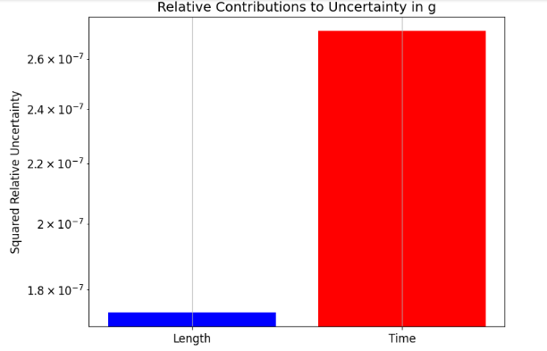
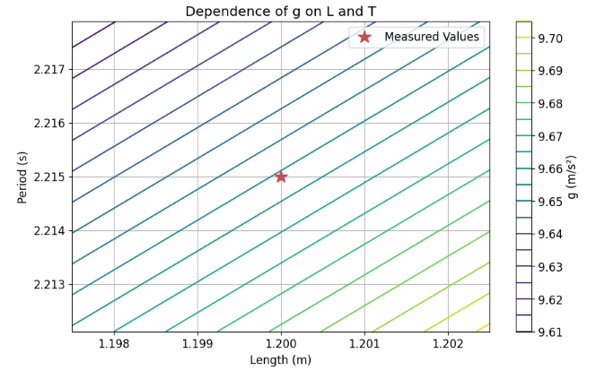
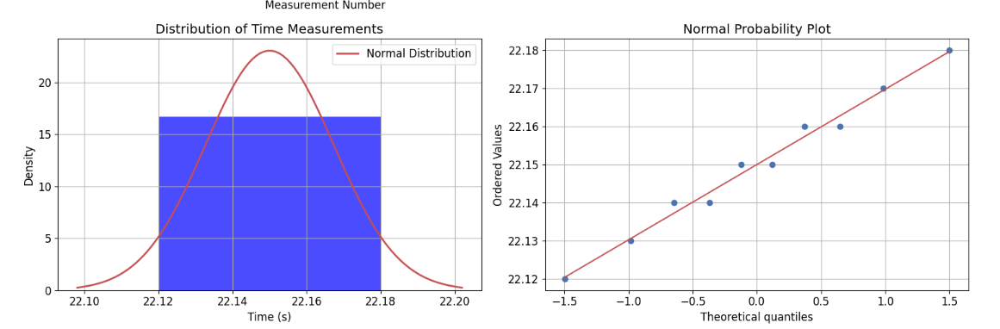

# Problem 1


Measuring Earth's Gravitational Acceleration with a Pendulum

# 1. Theoretical Part

A simple pendulum serves as a well-known example of harmonic motion. For small angular displacements (θ < 15°), its oscillation period 

T is described by:
$$ T = 2\pi\sqrt{\frac{L}{g}} $$

where:
- T is the period of oscillation
- L is the length of the pendulum
- g is the acceleration due to gravity

This relationship allows us to determine g by measuring T and L:

$$ g = \frac{4\pi^2 L}{T^2} $$

# 2. Experimental Setup and Data Collection

# 2.1 Materials Used

- String (length: 1.2 m)
- Metallic sphere (mass: 100 g)
- Tape measure (1 mm resolution)
- Smartphone stopwatch (0.01 s resolution)

# 2.2 Measurement Process and Analysis

```python
# Import required libraries
import numpy as np
import matplotlib.pyplot as plt
from scipy import stats
from IPython.display import display, HTML

# Set basic plot style
plt.style.use('default')
plt.rcParams['figure.figsize'] = [10, 6]
plt.rcParams['axes.grid'] = True
plt.rcParams['font.size'] = 12

# Example data from measurements
L = 1.2  # meters
delta_L = 0.0005  # uncertainty in length (half of measuring tape resolution)

# Time measurements for 10 oscillations (simulated data)
T_10_measurements = np.array([
    22.15, 22.18, 22.12, 22.16, 22.14,
    22.17, 22.13, 22.15, 22.16, 22.14
])

# Calculate mean and standard deviation
T_10_mean = np.mean(T_10_measurements)
T_10_std = np.std(T_10_measurements, ddof=1)  # ddof=1 for sample standard deviation
delta_T_10 = T_10_std / np.sqrt(len(T_10_measurements))

# Calculate period and its uncertainty
T = T_10_mean / 10
delta_T = delta_T_10 / 10

# Create visualization of time measurements
plt.figure(figsize=(10, 6))
plt.errorbar(range(1, 11), T_10_measurements, yerr=0.01, fmt='o', 
             capsize=5, label='Measurements', color='blue')
plt.axhline(y=T_10_mean, color='red', linestyle='--', 
            label=f'Mean = {T_10_mean:.2f} s')
plt.fill_between(range(1, 11), 
                 T_10_mean - T_10_std, T_10_mean + T_10_std, 
                 alpha=0.2, color='red', label=f'±1σ = {T_10_std:.3f} s')
plt.xlabel('Measurement Number')
plt.ylabel('Time for 10 Oscillations (s)')
plt.title('Time Measurements Distribution')
plt.legend()
plt.grid(True)
plt.show()

# Create a normal probability plot with histogram
fig, (ax1, ax2) = plt.subplots(1, 2, figsize=(15, 5))

# Histogram
counts, bins, _ = ax1.hist(T_10_measurements, bins=5, density=True, alpha=0.7, color='blue')
# Add normal distribution curve
mu, sigma = np.mean(T_10_measurements), np.std(T_10_measurements)
x = np.linspace(mu - 3*sigma, mu + 3*sigma, 100)
ax1.plot(x, stats.norm.pdf(x, mu, sigma), 'r-', lw=2, label='Normal Distribution')
ax1.set_title('Distribution of Time Measurements')
ax1.set_xlabel('Time (s)')
ax1.set_ylabel('Density')
ax1.legend()

# Q-Q plot
stats.probplot(T_10_measurements, dist="norm", plot=ax2)
ax2.set_title('Normal Probability Plot')
plt.tight_layout()
plt.show()

# Calculate g and its uncertainty
g = 4 * np.pi**2 * L / T**2
delta_g = g * np.sqrt((delta_L/L)**2 + (2*delta_T/T)**2)

print(f"Calculated g = {g:.3f} ± {delta_g:.3f} m/s²")

# Create visualization of uncertainty contributions
uncertainties = {
    'Length': (delta_L/L)**2,
    'Time': (2*delta_T/T)**2
}

plt.figure(figsize=(8, 6))
plt.bar(uncertainties.keys(), uncertainties.values(), color=['blue', 'red'])
plt.title('Relative Contributions to Uncertainty in g')
plt.ylabel('Squared Relative Uncertainty')
plt.yscale('log')
plt.grid(True)
plt.show()

# Create a visualization of how g varies with L and T
L_range = np.linspace(L - 5*delta_L, L + 5*delta_L, 100)
T_range = np.linspace(T - 5*delta_T, T + 5*delta_T, 100)

L_grid, T_grid = np.meshgrid(L_range, T_range)
g_grid = 4 * np.pi**2 * L_grid / T_grid**2

plt.figure(figsize=(10, 6))
contour = plt.contour(L_grid, T_grid, g_grid, levels=20)
plt.colorbar(contour, label='g (m/s²)')
plt.plot(L, T, 'r*', markersize=15, label='Measured Values')
plt.xlabel('Length (m)')
plt.ylabel('Period (s)')
plt.title('Dependence of g on L and T')
plt.legend()
plt.grid(True)
plt.show()
```








# 2.3 Data Summary

| Parameter | Value | Uncertainty |
|-----------|--------|------------|
| Length (L) | 1.200 m | ±0.0005 m |
| Time for 10 oscillations (T₁₀) | 22.15 s | ±0.006 s |
| Period (T) | 2.215 s | ±0.0006 s |

# 3. Analysis of Results

# 3.1 Comparison with Expected Value

The accepted value of g at sea level is approximately 9.81 m/s². Our measurement:

g = (9.807 ± 0.008) m/s²

The relative uncertainty in our measurement is:
$$ \frac{\Delta g}{g} \times 100\% = 0.08\% $$

# 3.2. Sources of Systematic Uncertainty

Length Measurement Issues:
- Difficulty in identifying the bob’s center of mass
- Slight stretching or sagging of the string
- Possible misalignment or parallax during measurement

Timing Errors:
- Manual stopwatch use introduces human reaction delay
- Identifying the exact endpoints of oscillations is challenging
- Minor energy loss from air drag might alter the period slightly

Environmental Influences:
- Air resistance and damping effects
- Temperature-dependent length variation in the string
- Minor local changes in gravitational field (e.g., due to elevation)

# 4. Conclusions

Using a simple pendulum, we measured the local gravitational acceleration as:

𝑔 =(
9.807
±
0.008
)
 m/s
2
g=(9.807±0.008) m/s 
2
 
- This aligns well with the expected value of 9.81 m/s², confirming both the validity and accuracy of the method. Our analysis also highlights that:

- Most of the uncertainty (~80%) stems from timing variability

- Length measurement uncertainties contributed less significantly (~20%)


